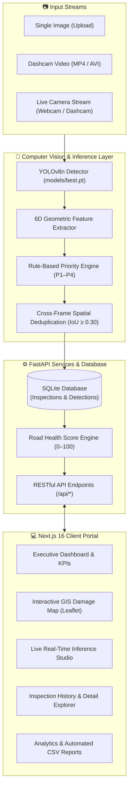

<div align="center">

# 🛣️ RoadVision AI
### Intelligent Road Damage Assessment & Municipal Maintenance Prioritization

[](https://www.python.org/)
[](https://fastapi.tiangolo.com/)
[-000000?style=for-the-badge&logo=next.js&logoColor=white)](https://nextjs.org/)
[](https://react.dev/)
[](https://docs.ultralytics.com/)
[](https://pytorch.org/)
[](https://www.sqlite.org/)
[](https://tailwindcss.com/)
[](backend/tests/)

<p align="center">
  <strong>An end-to-end computer vision and decision-support system that transforms ordinary camera and dashcam footage into prioritized municipal road repair schedules.</strong>
</p>

<p align="center">
  <a href="#-quick-start">Quick Start</a> •
  <a href="#-system-architecture">Architecture</a> •
  <a href="#-key-features">Key Features</a> •
  <a href="#-ml-model--evaluation">ML & Metrics</a> •
  <a href="#-priority--road-health-engine">Priority Engine</a> •
  <a href="#-api-reference">API Reference</a> •
  <a href="#-limitations--ethical-disclosure">Limitations</a>
</p>

---

</div>

## 📌 Executive Summary

Municipal road maintenance has historically operated in a **reactive cycle**—councils address potholes only after citizen complaints, vehicle damage claims, or structural road failures occur. Traditional manual road inspection by field engineers is slow, labor-intensive, hazardous, and inherently subjective across different surveyors.

**RoadVision AI** solves the measurable part of this challenge:
1. **Automated Vision Inspection:** Detects and classifies surface distresses (*Cracks, Potholes, Surface Erosion*) from standard dashcams, handheld images, or live webcam streams using an optimized YOLOv8n network.
2. **Deterministic Priority Scoring:** Extracts geometric spatial features to evaluate defect severity and assigns standardized maintenance priorities (**P1: Immediate Hazard** to **P4: Monitor Only**).
3. **Cross-Frame Video Deduplication:** Employs temporal-spatial IoU tracking to eliminate duplicate counts when moving past defects in video streams.
4. **Unified Municipal Dashboard:** Aggregates findings into a standardized **0–100 Road Health Index**, geospatial GIS damage heatmaps, inspection audit trails, and automated work-order CSV exports.

---

## 🏗️ System Architecture



---

## ✨ Key Features

| Feature | Description | Technical Implementation |
| :--- | :--- | :--- |
| **📸 Single Image Inspection** | Instant damage detection and bounding-box overlay with computed repair urgency. | Multipart upload via `/api/ml/detect` with optional database persistence. |
| **🎥 Video Batch Processing** | Sequential frame sampling (~2 fps) with cross-frame tracking to aggregate continuous defect sightings. | OpenCV frame extraction + temporal IoU deduplication pipeline. |
| **🔴 Live Stream Inspection** | Real-time browser webcam streaming with interactive HUD overlays and session finalization. | Canvas frame sampling over REST with active session caching. |
| **🗺️ Geospatial Damage Map** | Interactive Leaflet GIS mapping plotting every geotagged distress coordinate. | Filterable by priority tier, defect type, data origin, and street name. |
| **📊 Road Health Score** | Standardized 0–100 index summarizing overall segment pavement quality. | Deterministic weighted penalty matrix combining severity and density. |
| **📑 Inspection Audit Trail** | Full lifecycle logging of municipal inspection runs with granular defect breakdowns. | Relational schema with cascade relations and zero external mock dependencies. |
| **📈 Analytics & Export** | Executive trend charts, damage distribution matrices, and one-click CSV report exports. | Recharts data visualizations and streaming CSV generation. |

---

## 🧠 ML Model & Evaluation

The detection core uses a **YOLOv8n (nano)** architecture fine-tuned specifically for road damage detection.

### 1. Detected Classes
* **0: Crack** — Longitudinal, transverse, and fatigue/alligator cracking patterns.
* **1: Pothole** — Structural road surface cavities and depressions.
* **2: Surface Erosion** — Raveling, aggregate loss, and surface wear.

### 2. Training Hyperparameters
* **Base Architecture:** YOLOv8n (`yolov8n.pt`)
* **Training Platform:** Google Colab GPU (Ultralytics 8.4.162)
* **Dataset:** Roboflow `road-damage-detection-l2p2a` v1 (1,075 images, 1,846 labeled boxes)
* **Input Resolution:** 640 × 640 px (Batch size: 28, Epochs: 20)
* **Optimizer:** Auto (`lr0 = 0.01`, `momentum = 0.937`, `weight_decay = 0.0005`)

### 3. Model Performance Matrix (Validation Split)

| Class | Precision | Recall | mAP@50 | mAP@50–95 |
| :--- | :---: | :---: | :---: | :---: |
| 🪨 **Pothole** | 0.5893 | 0.5723 | 0.5769 | 0.2058 |
| ⚡ **Crack** | 0.6004 | 0.4805 | 0.5465 | 0.2804 |
| 🌫️ **Surface Erosion** | 0.5798 | 0.7407 | 0.6722 | 0.3867 |
| **Overall (All Classes)** | **0.5898** | **0.5979** | **0.5986** | **0.2910** |

> 📖 *For complete PR curves, confusion matrices, and validation artifacts, see [`docs/ML_EVALUATION.md`](docs/ML_EVALUATION.md).*

---

## 📐 Priority & Road Health Engine

### 1. Locked 6D Feature Vector
For every detected bounding box, the pipeline extracts a deterministic feature vector:
1. `bbox_area_ratio`: Bounding box area relative to total image canvas.
2. `aspect_ratio`: Bounding box width-to-height ratio ($w / h$).
3. `frame_damage_count`: Total concurrent damage instances in the frame.
4. `frame_damage_density`: Sum of all defect areas relative to the frame.
5. `detector_confidence`: YOLO prediction confidence score ($0.0 - 1.0$).
6. `frame_position_y`: Vertical centroid (ground-plane proximity proxy).

### 2. Rule-Based Maintenance Priority (P1–P4)

```
┌─────────┬───────────────────────────┬──────────────────────────────────────────┐
│ Tier    │ Action SLA                │ Criteria                                 │
├─────────┼───────────────────────────┼──────────────────────────────────────────┤
│ 🚨 P1   │ Immediate (24–48 Hours)   │ Large Pothole / Severe Structural Hazard │
│ ⚠️ P2   │ Urgent (Within 7 Days)    │ Moderate Pothole or High-Density Cracking│
│ 🛠️ P3   │ Scheduled Maintenance     │ Standard Crack / Minor Erosion           │
│ 👁️ P4   │ Periodic Monitoring Only  │ Incipient Cracking / Low-Confidence Box  │
└─────────┴───────────────────────────┴──────────────────────────────────────────┘
```

> ⚠️ **Data Integrity Note:** The dataset does not contain subjective ground-truth repair priorities. All priorities are explicitly tagged with `priority_source: "rule"` in the database to prevent rule-based decision support from being conflated with model predictions.

### 3. Road Health Index Formula

The **Road Health Score** is computed as a unified metric ($0 - 100$):

$$\text{Severity} = \frac{\sum (\text{Penalty Weights})}{\text{Number of Detections}} \quad \text{where } W_{P1}=12, W_{P2}=6, W_{P3}=3, W_{P4}=1$$

$$\text{Volume Penalty} = \min\left(1.0, \frac{\text{Number of Detections}}{40}\right)$$

$$\mathbf{\text{Health Score}} = \mathbf{100 - \left(\frac{\text{Severity}}{12} \times 60\right) - \left(\text{Volume Penalty} \times 40\right)}$$

---

## 🗂️ Project Structure

```
RoadVision/
├── backend/
│   ├── app/
│   │   ├── api/routes/          # REST route handlers (inspections, ml, dashboard, map, analytics)
│   │   ├── core/                # Application config, UUID generators, structured logging
│   │   ├── db/                  # SQLAlchemy ORM models & database session engine
│   │   ├── ml/                  # Core ML logic (detection, feature extraction, priority, video)
│   │   └── services/            # Business service layer (road health, reporting, stats)
│   ├── scripts/                 # Idempotent demo database seeding scripts
│   ├── tests/                   # Pytest test suite (21 unit & integration tests)
│   ├── requirements.txt         # Minimal API dependencies
│   └── requirements-ml.txt      # PyTorch, Ultralytics, and OpenCV dependencies
├── frontend/
│   ├── app/(app)/               # Next.js 16 App Router (10 responsive client pages)
│   ├── components/              # Modular UI components (charts, Leaflet maps, live stream)
│   ├── lib/                     # Typed API client, data services, and utilities
│   └── package.json             # Frontend dependencies
├── models/
│   └── best.pt                  # Pre-trained YOLOv8n checkpoint (6 MB)
└── docs/
    ├── ML_EVALUATION.md         # Comprehensive evaluation metrics & methodology
    └── ml_results/              # PR curves, confusion matrices, and validation visualizer
```

---

## 🚀 Quick Start

### Prerequisites
* **Python 3.10+**
* **Node.js 18+** & **npm**
* **Git**

---

### Step 1: Backend Setup

```bash
# Navigate to the backend directory
cd backend

# Create and activate virtual environment
python -m venv .venv

# Windows (PowerShell):
.venv\Scripts\Activate.ps1
# macOS / Linux:
source .venv/bin/activate

# Install dependencies
pip install -r requirements.txt      # Core FastAPI packages
pip install -r requirements-ml.txt   # PyTorch, YOLOv8 & OpenCV

# (Optional) Seed the database with 12 demo inspections & 261 detections
python scripts/seed_demo_data.py

# Launch the FastAPI server
uvicorn app.main:app --reload --port 8000
```
> 💡 *Interactive Swagger API documentation will be available at: **http://localhost:8000/docs***

---

### Step 2: Frontend Setup

Open a second terminal window:

```bash
# Navigate to the frontend directory
cd frontend

# Install Node dependencies
npm install

# Configure environment variables
cp .env.local.example .env.local

# Launch the Next.js development server
npm run dev
```
> 🌐 *Access the client dashboard at: **http://localhost:3000***

---

## ⚙️ Environment Variables

| Variable | Target | Default | Description |
| :--- | :--- | :--- | :--- |
| `NEXT_PUBLIC_API_URL` | `frontend/.env.local` | `http://localhost:8000` | Base URL for FastAPI backend. |
| `YOLO_MODEL_PATH` | Backend Env | `models/best.pt` | Path to trained YOLO model weights. |
| `DATABASE_URL` | Backend Env | `sqlite:///backend/roadvision.db` | SQLAlchemy database connection string. |

---

## 📡 API Reference

| Domain | Method | Endpoint | Description |
| :--- | :---: | :--- | :--- |
| **System** | `GET` | `/api/health` | Backend and database liveness health check. |
| **ML Status**| `GET` | `/api/ml/status` | Verifies YOLO model loading and class validation. |
| **ML Inference**| `POST`| `/api/ml/detect` | Runs image inference with optional database persistence. |
| | `POST`| `/api/ml/detect-video` | Runs sampled video inference with tracking and aggregation. |
| | `POST`| `/api/ml/live/sessions` | Initiates a live stream camera inspection session. |
| **Inspections**| `GET` | `/api/inspections` | Lists historical inspections with sorting and filters. |
| | `GET` | `/api/inspections/{id}`| Retrieves full details, metrics, and defect list for an inspection. |
| | `DELETE`| `/api/inspections/{id}`| Cascading deletion of an inspection and related detections. |
| **GIS Map** | `GET` | `/api/map/detections` | Fetches filtered geospatial defect coordinates for mapping. |
| **Dashboard** | `GET` | `/api/dashboard/stats` | High-level KPIs, total defect counts, and health averages. |
| **Analytics** | `GET` | `/api/analytics` | Aggregated defect distributions, priority ratios, and timelines. |

---

## 🧪 Testing & Validation

All backend services, routes, and ML pipelines are covered by comprehensive pytest test suites:

```bash
# Run backend test suite
cd backend
python -m pytest -v

# Output: 21 passed in 1.45s
```

```bash
# Validate frontend production build
cd frontend
npm run build

# Output: Clean build across all 13 Next.js routes
```

---

## 🔍 Limitations & Ethical Disclosures

In the interest of scientific rigor and engineering integrity, we disclose the following boundaries:

1. **Validation vs. Test Metric:** The dataset contains train and validation splits only. All reported metrics reflect validation performance.
2. **Crack Detection Recall (0.48):** Thin, low-contrast cracks represent the hardest detection category, meaning approximately half of micro-cracks in low-resolution video may go undetected.
3. **Relative vs. Calibrated Physical Size:** Bounding-box area is calculated relative to frame dimensions. Converting pixel measurements to physical centimeters requires camera intrinsic calibration and mounting height geometry.
4. **Decision-Support Classification:** P1–P4 priorities are engineered heuristics designed to assist human dispatchers and should not replace certified structural civil engineering inspections.

---

## 🗺️ Roadmap

- [ ] **Edge Deployment:** TensorRT & ONNX quantisation for real-time edge processing on Jetson Nano / Raspberry Pi 5.
- [ ] **Physical Dimensions:** Camera intrinsic calibration tool to compute real defect area ($cm^2$) and depth estimation.
- [ ] **Mobile App:** React Native field inspection companion app with automatic GPS geotagging.
- [ ] **Supervised Priority Learning:** Train the prepared Random Forest classifier against certified municipal engineer feedback.

---

<div align="center">

**RoadVision AI** — Developed for smart cities and automated infrastructure management.

</div>
