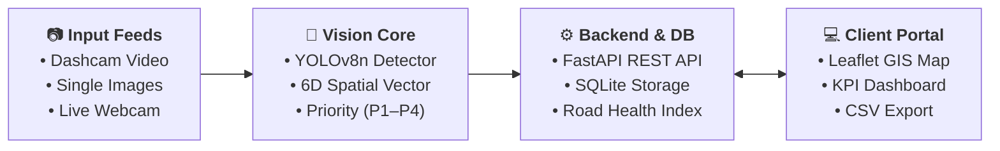

# RoadVision AI

> **Intelligent Road Damage Assessment & Municipal Maintenance Prioritization**  
> An automated computer vision and decision-support system transforming camera feeds and dashcam footage into prioritized municipal road repair schedules.

---

## 📌 Overview & Problem Statement

Municipal road maintenance has traditionally relied on reactive workflows—repairing structural road hazards only after citizen complaints, vehicle damage claims, or severe pavement degradation occur. Manual road inspections by field surveyors are time-consuming, hazardous, resource-intensive, and prone to subjective severity ratings.

**RoadVision AI** bridges this gap with an automated end-to-end computer vision and spatial decision-support pipeline:
* **Automated Visual Detection:** Identifies and classifies pavement surface distresses (*Cracks, Potholes, and Surface Erosion*) from dashcam videos, handheld imagery, or live camera streams using a fine-tuned YOLOv8n detector.
* **Deterministic Priority Scoring:** Extracts 6D geometric spatial features per defect to assign actionable maintenance priority tiers (**P1: Immediate Hazard** to **P4: Periodic Monitoring**).
* **Road Health Index (0–100):** Aggregates defect density and severity weights into a standardized pavement health rating per road segment.
* **Geospatial Municipal GIS Portal:** Visualizes distress locations on interactive GIS maps, raises real-time hazard alerts, and enables automated CSV work-order exports for municipal dispatchers.

---

## 🛠️ Technology Stack

| Layer | Technologies & Frameworks | Key Role |
| :--- | :--- | :--- |
| **Computer Vision & ML** | `YOLOv8n` (Ultralytics) · `PyTorch` · `OpenCV` · `Scikit-learn` | Real-time object detection, frame extraction, IoU tracking, 6D feature extraction |
| **Backend & API** | `FastAPI` · `Python 3.10+` · `Pydantic v2` · `Uvicorn` | High-performance asynchronous REST endpoints, validation, session caching |
| **Database & ORM** | `SQLite` · `SQLAlchemy 2.0` | Persistent inspection records, geotagged detection coordinates, cascade relations |
| **Frontend Portal** | `Next.js 16` (App Router) · `React 19` · `TypeScript` | Responsive municipal dashboard, inspection studio, and report builders |
| **Styling & Icons** | `Tailwind CSS v4` · `Lucide Icons` | Custom dark/light mode tokens, typography, HUD controls, and animations |
| **GIS & Data Viz** | `Leaflet` · `React-Leaflet` · `Recharts` | Interactive spatial distress map, hotspot clustering, and KPI charts |
| **Testing & Quality** | `Pytest` (21 Tests) · `Turbopack` · `OpenAPI / Swagger` | Automated unit/integration test suite, clean production builds, interactive API docs |

---

## 🏗️ System Architecture



---

## ✨ Core Capabilities

| Feature | Description | Technical Implementation |
| :--- | :--- | :--- |
| **Live Camera Inspection** | Real-time browser webcam / mobile camera inference with live bounding-box overlays and running defect feeds. | HTML5 Canvas frame capture (~2 FPS) over REST with session state caching. |
| **Video Processing** | Automated frame sampling and tracking across sequential dashcam video footage. | OpenCV temporal sampling + cross-frame IoU spatial deduplication. |
| **Single Image Inspection** | Instant distress classification, bounding box coordinates, and computed repair urgency. | Multipart image upload via `/api/ml/detect` with optional database persistence. |
| **Interactive GIS Map** | Geospatial plotting of all geotagged road defects across urban road corridors. | Leaflet GIS map with filterable layers (by priority, damage type, and street). |
| **Road Health Score** | Standardized 0–100 metric summarizing overall pavement condition. | Weighted penalty algorithm balancing structural severity and defect density. |
| **Municipal Work-Order Export** | One-click export of prioritized repair lists for municipal dispatchers and contractors. | Streaming CSV generation structured with defect locations, classes, and SLAs. |

---

## 💾 Pre-Seeded Demonstration Data

To enable immediate exploration without requiring manual field recording first, the database is pre-seeded with **12 demonstration inspections** and **261 geotagged road detections**:

* **Geographic Coverage:** Major urban road corridors (e.g., *Anna Salai, Poonamallee High Road, OMR, GST Road, Velachery Main Road*).
* **Data Integrity Tagging:** All pre-seeded records are explicitly marked with `data_origin: "demo"` in the database and displayed with a **Demo** badge in the UI to distinguish simulated baseline data from newly processed field inspections (`data_origin: "live"` or `"upload"`).
* **Instant Dashboard Population:** The GIS damage map, health score charts, active alerts panel, and analytics matrices are immediately populated upon initial launch.

---

## 🧠 Machine Learning & Priority Engine

### 1. Detected Distress Classes
* **Pothole:** Structural road surface depressions and cavities.
* **Crack:** Longitudinal, transverse, and fatigue/alligator cracking patterns.
* **Surface Erosion:** Surface wear, raveling, and aggregate loss.

### 2. Model Performance Summary (Validation Set)

| Class | Precision | Recall | mAP@50 | mAP@50–95 |
| :--- | :---: | :---: | :---: | :---: |
| **Pothole** | 0.5893 | 0.5723 | 0.5769 | 0.2058 |
| **Crack** | 0.6004 | 0.4805 | 0.5465 | 0.2804 |
| **Surface Erosion** | 0.5798 | 0.7407 | 0.6722 | 0.3867 |
| **Overall (All Classes)** | **0.5898** | **0.5979** | **0.5986** | **0.2910** |

> *Model Weights Checkpoint: Available at `models/best.pt` (6.0 MB).*

---

### 3. Maintenance Priority Matrix (P1–P4)

Each detected bounding box is evaluated through a deterministic 6D spatial feature vector (`bbox_area_ratio`, `aspect_ratio`, `frame_damage_count`, `frame_damage_density`, `detector_confidence`, `frame_position_y`):

```
┌──────┬──────────────────────────┬──────────────────────────────────────────────────────┐
│ Tier │ Response SLA             │ Criteria & Severity Definition                       │
├──────┼──────────────────────────┼──────────────────────────────────────────────────────┤
│ 🚨 P1 │ Immediate (24–48 Hours)  │ Large Potholes or Severe Structural Hazards          │
│ ⚠️ P2 │ Urgent (Within 7 Days)   │ Moderate Potholes or Dense Multi-Crack Clusters      │
│ 🛠️ P3 │ Scheduled Maintenance    │ Standard Longitudinal/Transverse Cracks              │
│ 👁️ P4 │ Periodic Monitoring      │ Minor Surface Erosion or Incipient Micro-Cracking    │
└──────┴──────────────────────────┴──────────────────────────────────────────────────────┘
```

---

### 4. Road Health Index Formulation

The overall segment **Road Health Score** is computed on a **0 to 100** scale:

$$\text{Severity Penalty} = \frac{\sum (W_{P1} \times N_{P1} + W_{P2} \times N_{P2} + W_{P3} \times N_{P3} + W_{P4} \times N_{P4})}{\text{Total Detections}}$$

$$\text{where } W_{P1} = 12,\; W_{P2} = 6,\; W_{P3} = 3,\; W_{P4} = 1$$

$$\text{Volume Penalty} = \min\left(1.0, \frac{\text{Total Detections}}{40}\right)$$

$$\mathbf{\text{Road Health Score}} = \mathbf{100 - \left(\frac{\text{Severity Penalty}}{12} \times 60\right) - \left(\text{Volume Penalty} \times 40\right)}$$

---

## 🚀 Quick Start Guide

### Prerequisites
* **Python 3.10+**
* **Node.js 18+** & **npm**

---

### Step 1: Backend Setup (FastAPI & ML Engine)

```bash
# 1. Navigate to backend directory
cd backend

# 2. (Optional) Create and activate virtual environment
python -m venv .venv
# Windows (PowerShell):
.venv\Scripts\Activate.ps1
# macOS / Linux:
source .venv/bin/activate

# 3. Install dependencies
pip install -r requirements.txt
pip install -r requirements-ml.txt

# 4. (Optional) Seed demonstration data (12 inspections, 261 detections)
python scripts/seed_demo_data.py

# 5. Start the FastAPI backend server
uvicorn app.main:app --host 0.0.0.0 --port 8000
```
> 📚 *Interactive Swagger API documentation will be available at: **http://localhost:8000/docs***

---

### Step 2: Frontend Setup (Next.js 16 Client Portal)

Open a second terminal window:

```bash
# 1. Navigate to frontend directory
cd frontend

# 2. Install dependencies
npm install

# 3. Configure environment variable
# Copy .env.local.example to .env.local (contains NEXT_PUBLIC_API_URL=http://localhost:8000)
cp .env.local.example .env.local

# 4. Launch development server
npm run dev
```
> 🌐 *Access the portal dashboard at: **http://localhost:3000***

---

## ☁️ Deployment Guide

### Option A: Frontend on Vercel
1. Import the repository into **[Vercel](https://vercel.com)** and set the Root Directory to **`frontend`**.
2. Add the Environment Variable:
   ```env
   NEXT_PUBLIC_API_URL=https://your-backend-api.onrender.com
   ```
3. Click **Deploy**.

### Option B: Backend on Render / Railway
1. Create a new **Web Service** pointing to the **`backend`** folder.
2. Set Build Command: `pip install -r requirements.txt && pip install -r requirements-ml.txt`
3. Set Start Command: `uvicorn app.main:app --host 0.0.0.0 --port $PORT`

---

## 🧪 Testing & Validation

```bash
# Run backend pytest test suite (21 unit & integration tests)
cd backend
python -m pytest -v

# Run frontend production build check
cd frontend
npm run build
```

---

## 📡 REST API Reference

| Domain | Method | Endpoint | Description |
| :--- | :---: | :--- | :--- |
| **System** | `GET` | `/api/health` | Service and database liveness health check. |
| **ML Status** | `GET` | `/api/ml/status` | Verifies YOLO model loading and class validation. |
| **Inference** | `POST` | `/api/ml/detect` | Runs single-image inference with optional database saving. |
| | `POST` | `/api/ml/detect-video` | Processes uploaded video with temporal IoU deduplication. |
| | `POST` | `/api/ml/live/sessions` | Initiates a live webcam/dashcam streaming session. |
| | `POST` | `/api/ml/detect-frame` | Evaluates a single live video frame in real time. |
| | `POST` | `/api/ml/live/sessions/{id}/finalize` | Aggregates and saves a live inspection run. |
| **Inspections** | `GET` | `/api/inspections` | Lists historical inspections with search and filters. |
| | `GET` | `/api/inspections/{id}` | Returns full defect details and metrics for an inspection. |
| | `DELETE` | `/api/inspections/{id}` | Cascading deletion of an inspection record. |
| **GIS Map** | `GET` | `/api/map/detections` | Retrieves geotagged defect coordinates for Leaflet GIS. |
| **Dashboard** | `GET` | `/api/dashboard/stats` | Executive KPI stats, daily counts, and health averages. |
| **Analytics** | `GET` | `/api/analytics` | Aggregated damage distributions, trends, and rankings. |

---

## ⚖️ Engineering Disclosures

1. **Decision-Support Scope:** P1–P4 priorities are engineered heuristics designed to assist municipal dispatchers in scheduling repairs and should complement certified civil engineering inspections.
2. **Relative Sizing:** Defect area ratios are computed relative to the camera frame resolution. Converting pixel metrics to physical dimensions ($cm^2$) requires camera intrinsic calibration and fixed mounting geometry.
3. **Data Origin Transparency:** Simulated demonstration records are explicitly tagged (`data_origin: "demo"`) to preserve data integrity alongside real field records (`data_origin: "live"` / `"upload"`).

---

<div align="center">
  <strong>RoadVision AI</strong> — Automated Infrastructure Vision & Maintenance Decision Support
</div>
