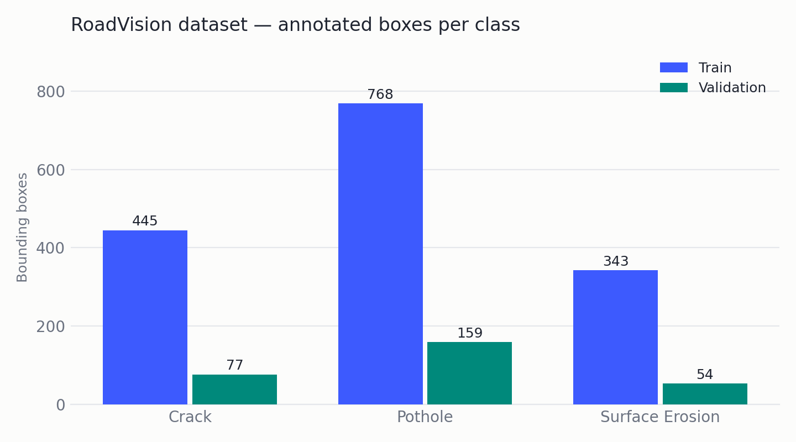
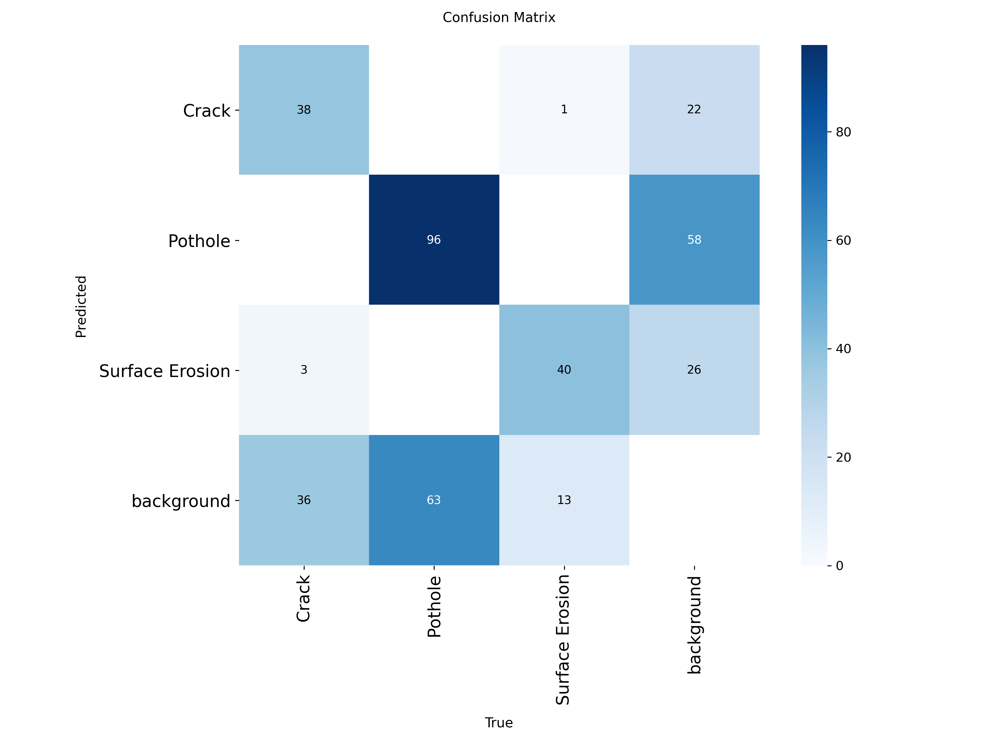

# RoadVision — YOLOv8n Model Evaluation

**Every number in this document was measured by re-running the trained checkpoint against the
validation split. Nothing is estimated, and nothing is carried over from memory.**

Artifacts: [`docs/ml_results/`](ml_results/) · raw numbers: [`ml_results/metrics.json`](ml_results/metrics.json)

---

## 1. Dataset

Roboflow export "road-damage-detection-l2p2a" v1 (2025-06-10, CC BY 4.0), YOLO detection format,
640×640. Counts below were **verified by reading every label file**, not copied from the
dataset card (`ml_results/dataset_distribution.json`).

| Split | Images | Bounding boxes |
|---|---|---|
| Train | 914 | 1,556 |
| Validation | 161 | 290 |
| **Total** | **1,075** | **1,846** |

Boxes per class:

| Class | Train | Validation | Total |
|---|---|---|---|
| Crack | 445 | 77 | 522 |
| Pothole | 768 | 159 | 927 |
| Surface Erosion | 343 | 54 | 397 |

4 training images contain no annotated damage (legitimate negatives). **There is no independent
test split** — see Limitations.



---

## 2. Model

| Item | Value |
|---|---|
| Architecture | YOLOv8n (nano), fine-tuned from `yolov8n.pt` |
| Task | Object detection |
| Classes | `0 = Crack`, `1 = Pothole`, `2 = Surface Erosion` |
| Checkpoint | `models/best.pt` (6.0 MB) |
| Ultralytics version | 8.4.162 |
| Trained | 2026-09-25 |

The checkpoint's own class names were checked against the application's class map at load time;
they match exactly, so detections are labelled correctly by index.

---

## 3. Training configuration (read from the checkpoint, not assumed)

Every value below comes from `best.pt`'s stored `train_args`.

| Setting | Value | | Setting | Value |
|---|---|---|---|---|
| model | `yolov8n.pt` | | lr0 / lrf | 0.01 / 0.01 |
| epochs | 20 (all 20 completed) | | momentum | 0.937 |
| batch | 28 | | weight_decay | 0.0005 |
| imgsz | 640 | | warmup_epochs | 3.0 |
| optimizer | `auto` | | patience | 100 (never triggered) |
| device | GPU (`device=0`, Google Colab) | | seed / deterministic | 0 / true |
| workers | 8 | | AMP | enabled |
| pretrained | true | | close_mosaic | last 10 epochs |

Augmentation actually applied: `hsv_h 0.015`, `hsv_s 0.7`, `hsv_v 0.4`, `translate 0.1`,
`scale 0.5`, `fliplr 0.5`, `mosaic 1.0`, `erasing 0.4`, `auto_augment=randaugment`.
No rotation, shear, perspective, vertical flip, or mixup (`degrees`, `shear`, `perspective`,
`flipud`, `mixup` all 0).

Total training time: **289 seconds** across 20 epochs.

---

## 4. Validation results

Reproduced with:

```python
from ultralytics import YOLO
YOLO("models/best.pt").val(data="road_damage/data.yaml", split="val", imgsz=640, batch=16)
```

at Ultralytics defaults (`conf=0.001`, `iou=0.7`, `max_det=300`), on 161 images / 290 boxes.

### Overall

| Metric | Value |
|---|---|
| Precision | **0.5898** |
| Recall | **0.5979** |
| mAP@50 | **0.5986** |
| mAP@50–95 | **0.2910** |

These reproduce the metrics stored inside the checkpoint from the training run
(P 0.5892, R 0.5979, mAP@50 0.5993, mAP@50–95 0.2918) to within rounding — the evaluation is
repeatable.

### Per class

| Class | Precision | Recall | mAP@50 | mAP@50–95 | Val boxes |
|---|---|---|---|---|---|
| Crack | 0.6004 | 0.4805 | 0.5465 | 0.2804 | 77 |
| Pothole | 0.5893 | 0.5723 | 0.5769 | 0.2058 | 159 |
| Surface Erosion | 0.5798 | **0.7407** | **0.6722** | **0.3867** | 54 |

**Note on previously quoted figures.** The pair "Precision 0.6004 / Recall 0.4805" that has been
circulating is the **Crack per-class** result, not the overall model result. The overall figures
are the ones in the table above.

What the numbers say, stated plainly:

- **Crack has the weakest recall (0.48)** — it misses over half the cracks. Expected: cracks are
  thin, low-contrast and easily lost against road texture, and this is a known hard class in the
  road-damage literature.
- **Pothole has the weakest mAP@50–95 (0.21)** despite reasonable mAP@50 (0.58). The model finds
  potholes but localises their boundaries loosely, which is what the stricter IoU thresholds punish.
- **Surface Erosion scores best on every ranked metric** despite having the fewest boxes, because
  it covers large regions of a frame and is easier to localise.
- Precision is near-identical across classes (0.58–0.60) — no class is disproportionately
  over-predicted.

### Inference speed (CPU, this evaluation machine)

Preprocess 5.2 ms · **inference 125.6 ms** · postprocess 0.7 ms per 640×640 image, i.e. roughly
**8 images/second on CPU**. On the GPU used for training this would be far faster; report whichever
number matches the machine used for the demo.

---

## 5. Confusion matrix



Raw counts (rows = predicted, columns = ground truth):

| predicted ↓ / actual → | Crack | Pothole | Surface Erosion | background |
|---|---|---|---|---|
| **Crack** | 38 | 0 | 1 | 22 |
| **Pothole** | 0 | 96 | 0 | 58 |
| **Surface Erosion** | 3 | 0 | 40 | 26 |
| **background (missed)** | 36 | 63 | 13 | — |

Two things are worth saying in a viva:

1. **Class confusion is almost nil.** Only 4 boxes were assigned to the wrong damage class
   (1 Crack↔Surface Erosion, 3 Surface Erosion→Crack). When the model detects something, it
   nearly always names it correctly.
2. **The real error mode is detection, not classification.** 112 ground-truth boxes were missed
   entirely (bottom row) and 106 predictions landed on background (right column). Improving this
   model means improving recall and localisation, not the classifier head.

A normalized version is at [`ml_results/confusion_matrix_normalized.png`](ml_results/confusion_matrix_normalized.png).

---

## 6. Curves

| Curve | File |
|---|---|
| Precision–Recall | [`ml_results/pr_curve.png`](ml_results/pr_curve.png) |
| F1–Confidence | [`ml_results/f1_curve.png`](ml_results/f1_curve.png) |
| Precision–Confidence | [`ml_results/precision_curve.png`](ml_results/precision_curve.png) |
| Recall–Confidence | [`ml_results/recall_curve.png`](ml_results/recall_curve.png) |

All four were produced by Ultralytics during the validation run above — no custom plotting code,
no retraining. The F1–confidence curve is the one to look at when justifying the application's
`conf` threshold (currently 0.25).

---

## 7. Prediction examples

Six real validation images in [`ml_results/prediction_examples/`](ml_results/prediction_examples/),
run at the application's own thresholds (`conf=0.25`, `iou=0.45`). **Nothing was edited, and no
detection shown is asserted to be correct** — the ground-truth classes for each image are recorded
alongside in `examples.json` so predictions can be compared rather than assumed.

| File | What it shows | Predictions | Ground truth |
|---|---|---|---|
| `strong_pothole.jpg` | Confident multi-object case | 6 | 6 × Pothole |
| `strong_crack.jpg` | Clean single crack | 1 | 1 × Crack |
| `strong_surface_erosion.jpg` | Erosion found, two cracks missed | 1 | Surface Erosion + 2 × Crack |
| `multiple_detections.jpg` | 5 predictions against 3 labelled boxes — over-detection | 5 | 3 × Pothole |
| `difficult_low_confidence.jpg` | All predictions below 0.4 confidence | 2 | 1 × Pothole |
| `missed_detection.jpg` | **Failure case** — a labelled pothole not detected at all | 0 | 1 × Pothole |

The last three are included deliberately. A model evaluation that only shows successes is not an
evaluation.

Batch-level side-by-side views are also included:
[`val_batch0_ground_truth.jpg`](ml_results/val_batch0_ground_truth.jpg) vs
[`val_batch0_predictions.jpg`](ml_results/val_batch0_predictions.jpg).

---

## 8. Limitations — state these before anyone asks

1. **No independent test split.** The dataset ships train and validation only. Every metric in this
   document is therefore a **validation** metric, measured on data used for model selection during
   training. None of it should be called test accuracy.
2. **Small dataset.** 1,075 images and 1,846 boxes is modest for object detection; results would be
   expected to shift with a larger, more varied corpus.
3. **Class imbalance.** Pothole has roughly 2.3× the boxes of Surface Erosion, which is visible in
   the per-class results.
4. **The dataset provides damage classes and bounding boxes — not maintenance priorities.** There is
   no expert priority label anywhere in it.
5. **P1–P4 therefore come from this project's rule-based decision-support layer**, not from learned
   ground truth. They are provisional. Every detection the system stores or displays carries
   `priority_source: "rule"` so this can never be misread as a model output.
6. **Bounding-box area is a relative image feature, not a physical measurement.** A box occupying
   20% of a frame says nothing calibrated about a pothole's size in centimetres — that would need
   camera intrinsics, height and pose, none of which this system has.
7. **Generalisation is unverified.** Performance will vary with camera angle, mounting height,
   lighting, weather, road surface type and image quality. The training images were also exported at
   640×640 with a stretch resize, which distorts aspect ratio relative to a 16:9 dashcam frame — a
   known train/inference mismatch.
8. **Crack recall is 0.48.** In deployment terms, roughly half of cracks present would go
   unreported. This is the single most important number to disclose honestly.

---

## 9. One-paragraph summary for the report

> A YOLOv8n detector was fine-tuned for 20 epochs at 640×640 on a 1,075-image road-damage dataset
> (914 train / 161 validation, 1,846 annotated boxes across Crack, Pothole and Surface Erosion).
> On the validation split the model reaches precision 0.590, recall 0.598, mAP@50 0.599 and
> mAP@50–95 0.291. Per class, Surface Erosion performs best (mAP@50 0.672), Crack has the lowest
> recall (0.481), and Pothole shows the weakest strict localisation (mAP@50–95 0.206). The
> confusion matrix shows the dominant error is missed detection rather than misclassification:
> only 4 of 290 validation boxes were assigned the wrong class. Because the dataset provides no
> independent test split, these are validation metrics and are reported as such; and because it
> provides no maintenance-priority labels, the system's P1–P4 output is produced by a documented
> rule-based decision-support layer rather than learned from ground truth.

---

## 10. Reproducing this evaluation

```bash
cd backend
pip install -r requirements-ml.txt

python - <<'PY'
from ultralytics import YOLO
m = YOLO("../models/best.pt")
m.val(data="<path to>/road_damage/data.yaml", split="val", imgsz=640, batch=16, plots=True)
PY
```

Plots land in `runs/detect/val/`. The copies in `docs/ml_results/` came from exactly this run.
Nothing here modifies `models/best.pt`, and no training is performed.
